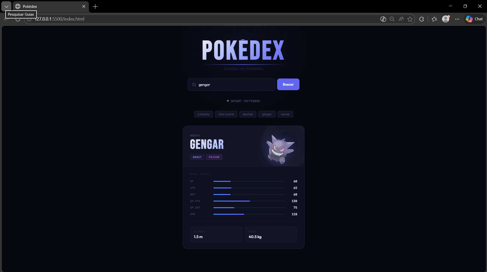

# API Pokédex

Uma Pokédex interativa desenvolvida com HTML, CSS e JavaScript puro, que consome a [PokéAPI](https://pokeapi.co/) para buscar e exibir informações dos Pokémon em tempo real.

---


> Pesquise qualquer Pokémon pelo nome ou número e veja seu card com imagem, tipos e stats!

---

##  Funcionalidades

-  Busca de Pokémon por **nome** ou **número**
-  Exibição da **imagem oficial** do Pokémon
-  Mostra o **número**, **nome** e **tipos** do Pokémon
-  Apresenta os **stats base** (HP, Ataque, Defesa, etc.)
-  Exibe mensagem de **erro** caso o Pokémon não seja encontrado
-  Layout **responsivo** para diferentes tamanhos de tela

---

##  Tecnologias Utilizadas

| Tecnologia | Descrição |
|---|---|
|  | Estrutura da aplicação |
|  | Estilização e responsividade |
|  | Lógica e consumo de API |
|  | Fonte de dados dos Pokémon |

---

## 📂 Estrutura do Projeto

```
Pokedex/
├── index.html    # Estrutura da página
├── style.css     # Estilos e layout
└── script.js     # Lógica e integração com a PokéAPI
```

---

## Como Executar Localmente

1. **Clone o repositório:**
   ```bash
   git clone https://github.com/JAMAL-RED/Pokedex.git
   ```

2. **Acesse a pasta do projeto:**
   ```bash
   cd Pokedex
   ```

3. **Abra o arquivo `index.html` no seu navegador** — sem necessidade de instalar dependências!

---

## API Utilizada

Este projeto consome a **[PokéAPI](https://pokeapi.co/)**, uma API RESTful gratuita e pública com dados de todos os Pokémon das principais gerações.

Endpoint utilizado:
```
https://pokeapi.co/api/v2/pokemon/{nome-ou-numero}
```

---

##  Preview



---

##  Autor

 **[JAMAL-RED](https://github.com/JAMAL-RED)**

---

## Licença

Este projeto está sob a licença MIT. Sinta-se à vontade para usar e modificar!
